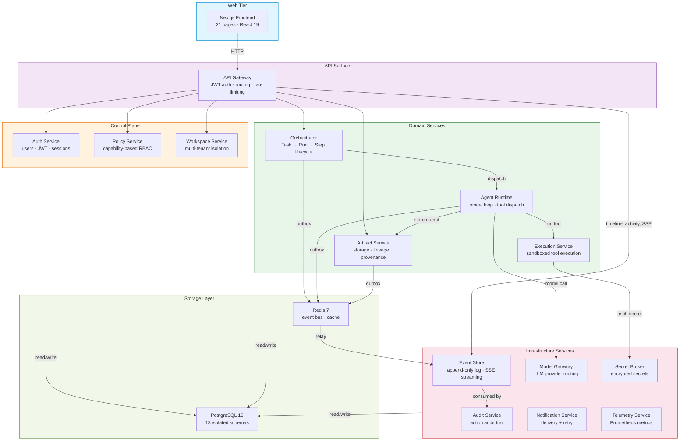

# Architecture Overview

> A quick visual guide for new contributors. For the full specification, see the
> [Documentation Index](docs-index.md) (18 architecture documents).

---

## At a Glance

Keviq Core is a **microservices platform** (15 Python/FastAPI services + 1 Next.js frontend)
for running AI agents in production. Services communicate via an **outbox pattern** over
Redis Streams — no direct service-to-service calls for state mutations. Each service owns
its own PostgreSQL schema; there are no shared tables or cross-schema joins.

---

## Service Groups

### Control Plane — identity and policy
**Auth**, **Policy**, and **Workspace** services handle user identity, capability-based
RBAC, and multi-tenant workspace isolation. Every request passes through the API Gateway,
which validates JWT tokens and resolves workspace membership before forwarding.

### Domain Services — core logic
The **Orchestrator** manages the task lifecycle (Task → Run → Steps). When a run starts,
it dispatches to the **Agent Runtime**, which drives a model-call → tool-call loop. Tool
calls execute in the **Execution Service** sandbox. Outputs are stored as first-class
artifacts in the **Artifact Service** with full provenance chains.

### Infrastructure Services — supporting concerns
The **Event Store** persists all domain events (append-only) and serves real-time SSE
streams for run progress and activity feeds. The **Model Gateway** proxies LLM calls to
configurable providers. **Audit**, **Notification**, **Secret Broker**, and **Telemetry**
services handle cross-cutting concerns without coupling to domain logic.

> **Note:** A separate `sse-gateway` service exists in the repo but is currently a stub
> (health endpoints only). All real-time streaming is handled by `event-store` today.

---

## Key Patterns

| Pattern | Where | Why |
|---------|-------|-----|
| **Outbox + relay** | Every service with mutations | Guarantees at-least-once event delivery without distributed transactions. Services write to a local outbox table; a relay publishes to Redis Streams. |
| **Schema-per-service** | All 13 DB-backed services | Enforces bounded contexts at the database level. No service can read another's tables. Validated by 910+ architecture tests. |
| **Capability-based RBAC** | Policy service | Permissions are fine-grained capabilities (`task:create`, `artifact:upload`), not rigid roles. Policies bind capabilities to workspace members. |
| **Event sourcing (read side)** | Event Store | The event log is the authoritative timeline. Services can rebuild state from events on recovery. |

---

## Where to Start Reading

| Interest | Start with | Then read |
|----------|-----------|-----------|
| Overall vision | [00 — Product Vision](00-product-vision.md) | [01 — Goals & Non-Goals](01-system-goals-and-non-goals.md) |
| Architecture rules | [02 — Invariants](02-architectural-invariants.md) | [03 — Bounded Contexts](03-bounded-contexts.md) |
| Data model | [04 — Core Domain Model](04-core-domain-model.md) | [05 — State Machines](05-state-machines.md) |
| API surface | [07 — API Contracts](07-api-contracts.md) | [SYSTEM.md](../SYSTEM.md) §4 |
| Security model | [08 — Sandbox Security](08-sandbox-security-model.md) | [09 — Permission Model](09-permission-model.md) |
| Service details | [15 — Backend Service Map](15-backend-service-map.md) | [14 — Frontend App Map](14-frontend-application-map.md) |
| Deployment & ops | [13 — Deployment Topology](13-deployment-topology.md) | [Production Checklist](ops/production-deployment-checklist.md) |
| Contributing code | [CONTRIBUTING.md](../CONTRIBUTING.md) | [Coding Rules](CODING-RULES.md) · [Testing Rules](TESTING-RULES.md) |
